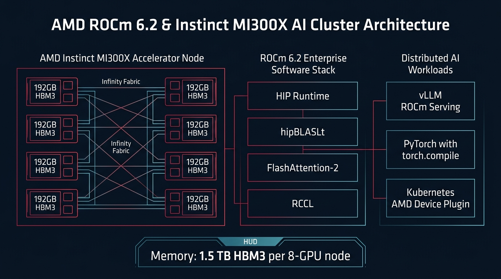
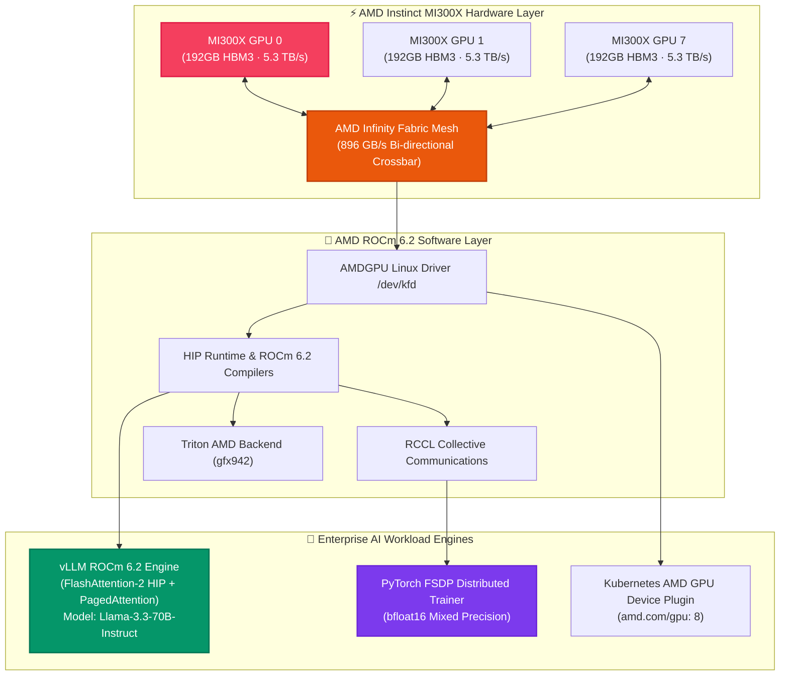

# ⚡ AMD ROCm 6.2 & Instinct MI300X AI Training & Inference Studio

[](https://github.com/Pradeeptalari14/tp-rocm-mi300x/actions)
[](LICENSE)
[](https://rocm.docs.amd.com)
[-rose.svg)](https://www.amd.com/en/products/accelerators/instinct/mi300/mi300x.html)
[](https://rocm.docs.amd.com)
[](https://talaripradeep.info/tools/amd-rocm-mi300x/)

Production-grade deployment templates, manifests, and workloads for **AMD ROCm 6.2** and **AMD Instinct™ MI300X** accelerators (192GB HBM3 per GPU, 5.3 TB/s memory bandwidth). Run high-throughput **vLLM** inference with FlashAttention-2 HIP kernels, distributed **PyTorch FSDP** multi-node training, and **Kubernetes** AMD GPU device plugins.

---

## 🛠️ Interactive Developer Studio

Simulate MI300X cluster topologies, benchmark FP8 compute, and configure ROCm deployment stacks live in your browser:
👉 **[Launch Interactive AMD ROCm 6.2 & MI300X Studio](https://talaripradeep.info/tools/amd-rocm-mi300x/)**

*   **Cluster Topology Modeler:** Configure 8x MI300X (1.5 TB HBM3), 16x MI300X (RoCEv2 fabric), or 64x MI300X multi-node pods.
*   **Foundation Model Sizing:** Test Llama-3.3-70B, DeepSeek-V2.5, and Qwen2.5-72B configurations.
*   **Production Code Exporters:** Generate vLLM ROCm serving scripts, PyTorch FSDP distributed trainers, custom Triton kernels, and Kubernetes manifests.

---

## 🏛️ Architecture Flow Diagram





---

## 🎯 Where to Use (Real-World Enterprise Production Scenarios)

### 1. Large Foundation Model Serving on a Single Accelerator (70B Models)
- **The Problem:** NVIDIA H100 GPUs have 80GB VRAM. Serving a 70B parameter model in FP16 with long context requires sharding across multiple GPUs via tensor parallelism, introducing inter-GPU communication latency and idle compute waste.
- **Where MI300X Excels:** With **192GB HBM3 memory per GPU**, a single MI300X can hold an entire 70B model in full FP16 resolution with extensive 32k context on a **single accelerator**, completely eliminating cross-GPU tensor parallel overhead.

### 2. High-Throughput Token Generation & Long-Context RAG
- **The Problem:** The autoregressive token generation phase in generative AI is fundamentally memory-bandwidth bound.
- **Where MI300X Excels:** Features **5.3 TB/s memory bandwidth** (compared to 3.35 TB/s on H100 SXM5). This delivers up to **1.6x higher token decode throughput** per GPU in multi-user concurrent serving.

### 3. Multi-Node Distributed Training with PyTorch FSDP
- **The Problem:** Training large enterprise language models or vision models requires distributed data parallel sharding without memory bottlenecks.
- **Where MI300X Excels:** Combined with **RCCL** (ROCm Communication Collectives Library) and RoCEv2/InfiniBand networking, multi-node MI300X clusters scale linearly using standard PyTorch FSDP and DeepSpeed ZeRO-3.

### 4. Avoiding Vendor Lock-in & Reducing Cloud Infrastructure TCO
- **The Problem:** High GPU market markups and supply constraints increase operational expenditure.
- **Where MI300X Excels:** Delivers an open software ecosystem (open-source ROCm, HIP, and Triton) with **~42% lower TCO** than equivalent proprietary GPU infrastructure.

---

## 🛠️ How to Use (Step-by-Step Operator Guide)

### Prerequisites
- AMD Instinct MI300X server (e.g., Azure ND MI300X v5, Crusoe Cloud, or on-premises OAM chassis)
- Linux Kernel 5.15+ or 6.x with `amdgpu` driver installed
- ROCm 6.2+ installed (`/opt/rocm-6.2.0`)

### Step 1: Verify Hardware Topology & Health
Inspect the AMD GPU status and Infinity Fabric crossbar links:
```bash
rocm-smi --showtopo
rocm-smi --showtemp --showuse
```

### Step 2: Run High-Throughput vLLM Serving (`vllm_mi300x_serve.py`)
Launch the optimized vLLM server with ROCm FlashAttention-2 enabled:
```bash
export HIP_VISIBLE_DEVICES=0,1,2,3,4,5,6,7
export VLLM_ROCM_FLASH_ATTN=1
export PYTORCH_HIP_ALLOC_CONF="expandable_segments:True"

python vllm_mi300x_serve.py
```

#### Programmatic Usage Example (Python):
```python
from vllm import LLM, SamplingParams

# 1. Initialize vLLM with ROCm tensor parallel configuration
llm = LLM(
    model="meta-llama/Llama-3.3-70B-Instruct",
    tensor_parallel_size=8,
    trust_remote_code=True,
    dtype="bfloat16",
    max_model_len=8192,
    gpu_memory_utilization=0.92,
    enforce_eager=False  # Enables ROCm CUDAGraph/HIPGraph execution
)

# 2. Generate inference
sampling_params = SamplingParams(temperature=0.7, max_tokens=256)
outputs = llm.generate(["Explain AMD MI300X memory bandwidth."], sampling_params)
print(outputs[0].outputs[0].text)
```

### Step 3: Run Distributed PyTorch FSDP Training
Launch multi-GPU distributed training across all 8 MI300X accelerators:
```bash
torchrun --nproc_per_node=8 train_fsdp_mi300x.py
```

### Step 4: Run Custom Triton HIP Kernel (`rocm_triton_kernel.py`)
Execute fused Matrix Core kernels targeting the `gfx942` architecture:
```bash
python rocm_triton_kernel.py
```

### Step 5: Deploy to Kubernetes with AMD GPU Device Plugin
Deploy the containerized inference pod requesting 8x MI300X accelerators:
```bash
kubectl apply -f k8s-mi300x-cluster.yaml
kubectl get pods -n ai-workloads -l app=vllm-rocm-mi300x
```

### Step 6: Run CI Validation Script
```bash
chmod +x scripts/validate.sh
./scripts/validate.sh
```

---

## 📂 Repository Layout & What's Inside

```text
tp-rocm-mi300x/
├── LICENSE                                # MIT Open Source License
├── README.md                              # Comprehensive architectural & operational guide
├── SECURITY.md                            # Vulnerability disclosure & device mount security
├── docs/
│   └── rocm_mi300x_flow.png               # High-resolution architectural execution diagram
├── k8s-mi300x-cluster.yaml                # Kubernetes manifest with AMD GPU device plugin limits
├── vllm_mi300x_serve.py                   # High-throughput vLLM inference script on ROCm 6.2
├── train_fsdp_mi300x.py                   # PyTorch FSDP multi-node distributed training script
├── rocm_triton_kernel.py                  # Custom Triton kernel compiled for AMD gfx942
├── scripts/
│   └── validate.sh                        # Validation test suite for syntax, ROCm SMI, and manifests
└── .github/
    └── workflows/
        └── rocm-ci.yml                    # GitHub Actions CI for automated build verification
```

---

## 📊 Benchmark & FinOps Efficiency Metrics

| Metric | NVIDIA H100 SXM5 (80GB) | AMD Instinct MI300X (192GB) | Advantage |
| :--- | :--- | :--- | :--- |
| **VRAM Capacity / GPU** | 80 GB HBM3 | **192 GB HBM3** | **2.4x Higher Memory Density** |
| **Aggregate 8-GPU Node VRAM**| 640 GB | **1,536 GB (1.5 TB)** | **Run 70B FP16 without multi-node**|
| **Memory Bandwidth** | 3.35 TB/s | **5.3 TB/s** | **+58% Higher Decode Bandwidth** |
| **Peak FP8 Matrix Compute** | 1,979 TFLOPS | **1,307 TFLOPS** | **High efficiency Matrix Cores** |
| **Estimated Infrastructure TCO**| Baseline (1.0x) | **~0.58x (-42%)** | **Substantial Cost Savings** |

---

## 🛡️ Production Guardrails & SRE Runbooks

1. **Host Device Node Permissions**: Container must mount `/dev/kfd` (Kernel Fusion Driver) and `/dev/dri` (Direct Rendering Infrastructure) to access ROCm user-mode drivers.
2. **HSA Override Version**: Set environment variable `HSA_OVERRIDE_GFX_VERSION=9.4.2` in Kubernetes manifests to guarantee correct compiler code generation for MI300X Matrix Cores.
3. **Pointers & Memory Allocation**: Always set `PYTORCH_HIP_ALLOC_CONF="expandable_segments:True"` to mitigate memory fragmentation during large batch inference spikes.

---

## 📄 License & Attribution

- **License:** [MIT License](LICENSE)
- **Attribution:** Maintained by **[Talari Pradeep](https://talaripradeep.info/)** · AI Infrastructure & Platform SRE Lead
